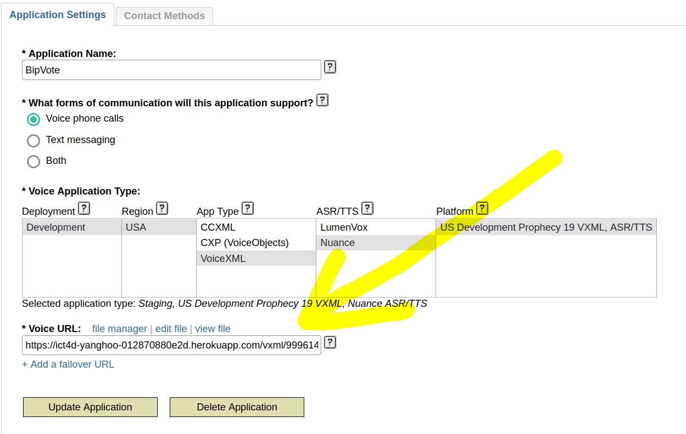
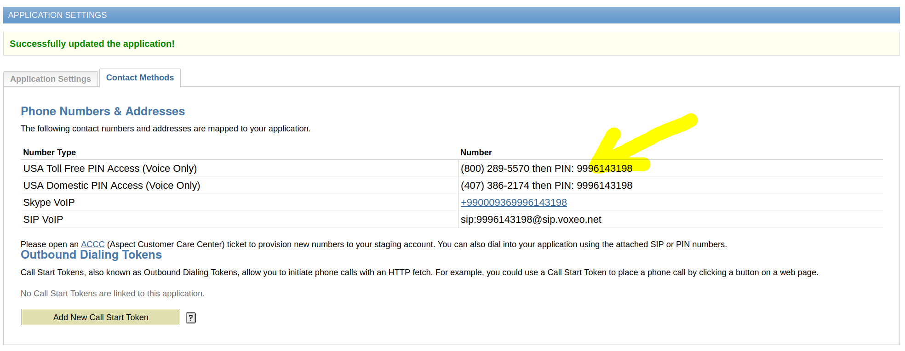
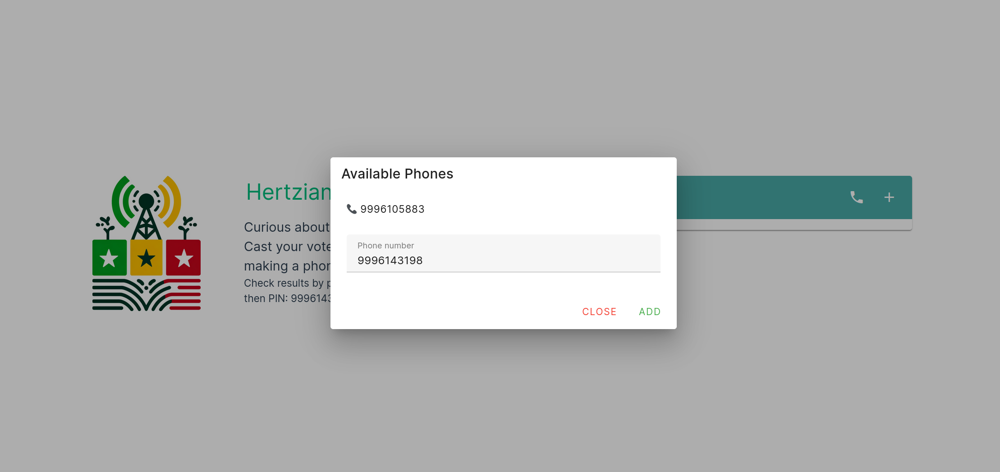

# Prototype Technical Documentations


*Figure 1: WEB User Interface*

## Prototype Interactions

GitHub Repository: [Hertzian-Harmony](https://github.com/PolymagicYang/Hertzian-Harmony). This repository provides detailed information on the development process, deployment methods, and usage instructions. You can interact with our frontend deployed at [Netlify](https://main--precious-crisp-61d133.netlify.app/), and find the backend hosted at [Heroku](https://ict4d-yanghoo-012870880e2d.herokuapp.com/).


*Figure 2: How to enter the correct URL into the box*


*Figure 3: How to find the correct phone number*

To add new phone numbers, you should log into your account page, open the application page, and look for the *Voice URL input box*. Here, you need to concatenate our backend API address:

`https://ict4d-yanghoo-012870880e2d.herokuapp.com/vxml/`

with the phone number you have obtained. For example, if your phone number is 1234567, you should enter:

`https://ict4d-yanghoo-012870880e2d.herokuapp.com/vxml/1234567.xml`

into the box to ensure the voice interface functions correctly. **Note that the phone number is the pin displayed on the page (9996143198, etc.)—do not confuse it with the US phone number ((800)-2895570)**.


*Figure 4: How to add a new phone number via our WEB UI*

### Interacting with Registered Phone Numbers

Once you register all the phone numbers, you should enter them via our web UI, accessible via the phone icon located on the upper right side of the questions. You need to add at least two phone numbers for the voting system to function correctly.

### Language Support

We now support five languages: Bambara, Bobo, Fula, French, and English. Thanks to state-of-the-art technology provided by OpenAI, we can automatically generate audios in these languages, making all these operations possible.

## Technical Implementations

The primary challenges associated with this application involve dynamically translating English into other languages and converting text into speech. We solve these issues by using the OpenAI API and local AI models. When an administrator adds a new question, our backend automatically processes these translations and conversions. The system functions similarly to a cache, enabling us to perform the translation once and then store the audio files on the backend file system and the text in the database. This approach allows for future reuse and significantly reduces costs.

Our telecommunication services are facilitated by Vovex, which requires knowledge of the host address for VXML file access. We have implemented a straightforward file system using FastAPI to manage the accessibility of these VXML files. Additionally, we have developed a suite of web APIs that automate the generation of VXML files. Administrators can input question descriptions directly into our web interface, triggering updates in the voice system based on their modifications.

Before adding new questions, administrators must verify the availability of unassigned phone numbers in our database. Only when sufficient unassigned numbers are available can they proceed to create new questions. Should there be a shortage, administrators can request additional numbers from Vovex and integrate them through our web API.

Once phone numbers are linked to specific questions, users can dial these numbers to cast votes (yes or no). The VXML files generated in response to these calls send GET requests to our backend API depending on the type of response (yes or no), and voting results are subsequently updated in the database. Administrators can view these results through our web interface.

To simulate the voting process, data submission to the backend is facilitated through the following HTML form structure:

```html
<form>
    <block>
        <submit next="{domain}api/vote/{number}" method="get"/>
    </block>
</form>

```
In this structure, domain refers to the Heroku_url, which is defined as an environment variable, and number represents the phone pin. Depending on the value of number, the backend increments the count in the respective voting category (e.g., "yes" votes). Each question XML file is tied specifically to a "yes" or "no" query, and all associated VXML files are generated dynamically.

Users also have the option to access real-time results via our voice API by calling the designated phone numbers. The VXML files containing the results are automatically updated following each call.

To enhance user experience, we have integrated the OpenAI API for automatic translation from English and a local Text-to-Speech (TTS) system for converting translated texts into audio files. This enables us to offer support in multiple languages. The generated audio files are stored in our file system, and their paths are recorded in the database for streamlined management.